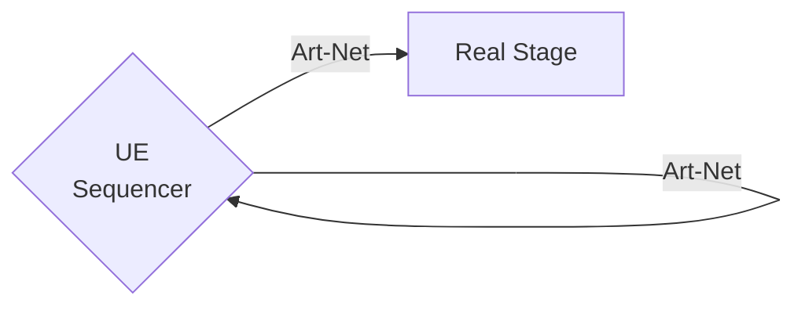
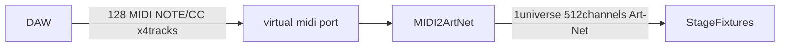

## Generic Test
### Attachment Test (Image files)
- Obsidian Drag&Drop Style 1
  ![[Publish/gatsby-garden/_notes/images/Lenna_(test_image).png]
- Obsidian Drag&Drop Style 2
  ![[Publish/gatsby-garden/_notes/images/Lenna_(test_image).png]] 
- Standard Style
  .png) 
   
  
<!--  -->

### URL Link Test
  [Invalid Link](./Markdown.md "title")  
  [Invalid Link](./Zettelkasten.md) need line break spell ?
  [Invalid Link](./Zettelkasten)
  [Invalid Link : Zettelkasten](Zettelkasten)
  [Invalid Link : ./zettelkasten.md](./zettelkasten.md)
  [Valid Link : ./zettelkasten](./zettelkasten)
  [Valid Link : zettelkasten](zettelkasten)
  [Valid Link : markdown](markdown)
  [[Zettelkasten]]
  [[Markdown]]
  test string
  yeah

### Youtube Embed Test
<iframe width="640" height="360" src="https://www.youtube.com/embed/PotroTeL1lE" frameborder="0" allow="accelerometer; autoplay; clipboard-write; encrypted-media; gyroscope; picture-in-picture" allowfullscreen></iframe>

### Mermaid Test

## obsidian-vimrc-support TEST
[[wiki]]

[test]()
[test](https://github.com/esm7/obsidian-vimrc-support)
